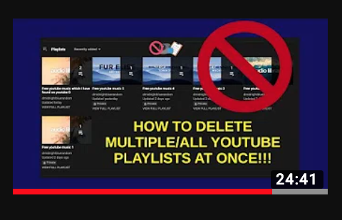

# YouTube delete multiple playlists script

## AN INTERNET FIRST!!! 🔝💯

## To the best of my knowledge, at the time of creating this there were no other available solutions on Google, YouTube or the Internet of how to delete multiple YouTube playlists at once.

----
💻

A bash script to delete multiple youtube playlists.

Please run the script with the required parameters as follows:

```bash
./delete_youtube_playlists_[VERSION].sh --file [FILE-LOCATION] --api_key [API-KEY] --authorization [AUTHORIZATION_TOKEN]
```

----

## NOTES:

- Everything is a Work In Progress (WIP).

----

## Shout-out to [D'Midnight Blue](https://www.youtube.com/channel/UCb5VRC39PqUgq8lMB1CQq3A) for making this how-to video tutorial guide:

[How-to video tutorial guide on using this script](https://www.youtube.com/watch?v=Gp1H0YBhoRQ) 👀⏯🎥

[](https://www.youtube.com/watch?v=Gp1H0YBhoRQ)

----

Found anything useful?! Buy us a cup of coffee if you feel like it. Thanks! 🙂🙏☕️:

♥︎ [Cup of coffee](https://sites.google.com/view/atkuzmanov/home) ☕️

----
